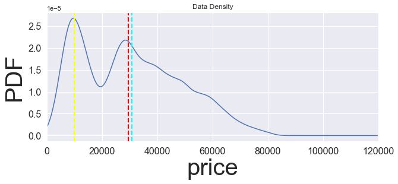
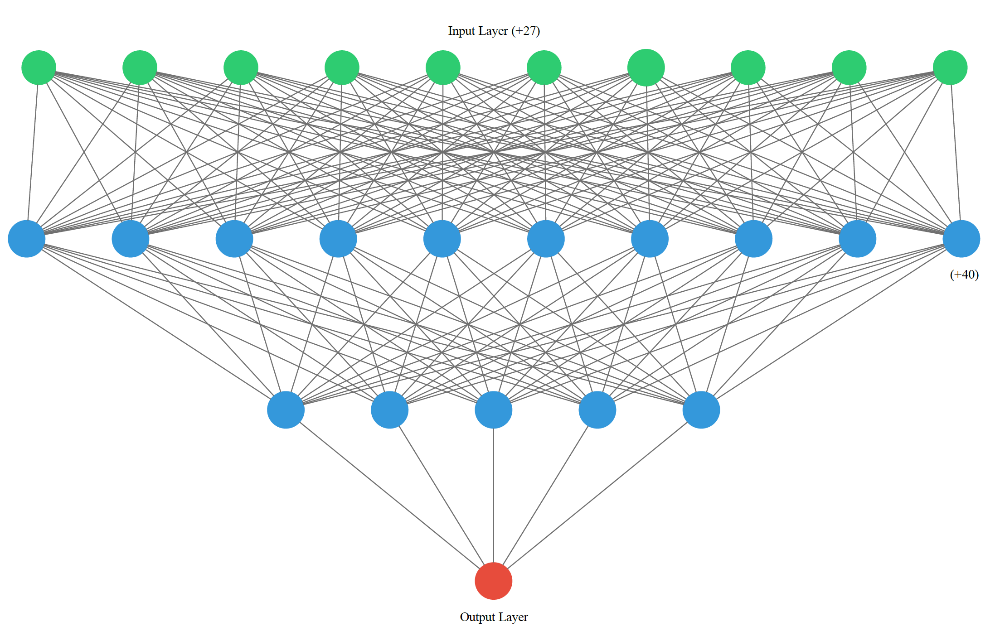
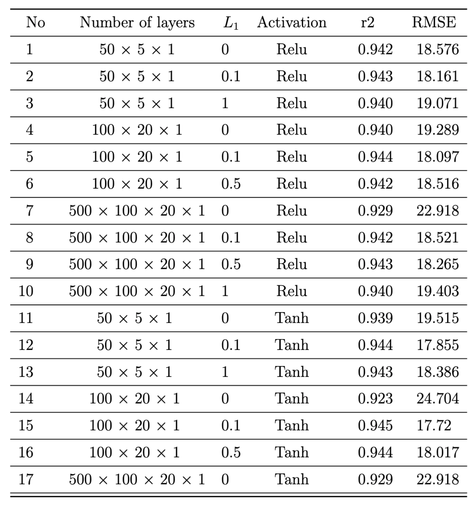

# The prediction of used car price
> Machine learning prediction of the price of used cars

## Table of Contents
* [General Info](#general-information)
* [Technologies Used](#technologies-used)
* [Room for Improvement](#room-for-improvement)
* [Acknowledgements](#acknowledgements)
* [Contact](#contact)
<!-- * [License](#license) -->

## General Information
- In this project, I developed several machine learning models to predict the price of used cars.
- The projects contains, feature engineering, data cleaning, data wrangling, exploratory data analysis, visulization and model development.
- Models include: 1) Linear regression, SVM, decision tree, random forest, gradient boosting, Neural Network, etc..
- There are 10 features "trim","isOneOwner","mileage","year","color","displacement","fuel","region","soundSystem","wheelType"
- There is one traget variable "price"

<!-- If you have screenshots you'd like to share, include them here. -->

## Technologies Used
- Python
- SciKit Learn
- Tensorflow
- Pandas
- Matplotlib

## Room for improvement:
- Will implement XGboost later

## Acknowledgements
- Thanks to Dr. Robert McCulloch for fruitful discussions.

## Contact
Created by [Miralireza Nabavi](anabavib@asu.edu) - feel free to contact me!
